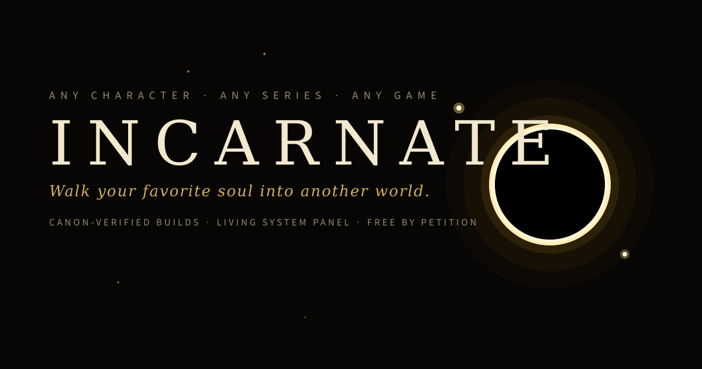

  

<h3 align="center"><em>Walk your favorite soul into another world.</em></h3>

---

**INCARNATE** forges fictional characters into playable, canon-verified builds for real video games — delivered as interactive command-center guides that track your entire run.

Ever wanted to play Elden Ring *as* Sunny from Shadow Slave? Nioh as Guts? That's an **Incarnation**: a complete translation of who a character *is* — their weapons, their instincts, their story arc — into a game's actual mechanics, items, and routes.

## ✦ What's inside an Incarnation

- **A full progression walkthrough**, phase by phase: turn-by-turn traversal from the game's opening, area threats tuned to the build, and boss strategies keyed to your exact loadout — never generic advice.
- **Character-creation guidance** as precise as the game allows — down to RGB color values where the creator accepts them, with honest flags where no analog exists.
- **A living system panel** styled as the character's own world: tappable objectives, titles earned per phase, a rank ladder, switchable visual "vessels," and ambient atmosphere drawn from the source material.
- **Canon discipline throughout.** Every lore detail is verified against source material. Where the game can't match canon, the guide says so plainly. *Canon is the spec; inventions get flagged at birth.*

## ✦ The Library

| Incarnation | Path | Status |
|---|---|---|
| **SUNNY** | Shadow Slave → Elden Ring | 🟢 **[Enter the Incarnation](https://claude.ai/public/artifacts/5fbd8bf3-1dbb-4b93-a903-c0a79743acc9)** |
| **JASON** | He Who Fights With Monsters → Elden Ring | 🛠 In the forge |
| **Your champion** | Any series → Any game | ✍ [Petition below](#-petition-the-gate) |

## ✦ The Gate

**[→ Enter the Gate](https://claude.ai/public/artifacts/f31fc12a-5cd4-4f69-ba8d-b949ba57af92)** — browse the Library and petition from one place.

## ✦ Petition the Gate

The Library grows by request. Name a soul and a world:

**[→ Open a petition](https://github.com/Vanztnt/Incarnate/issues/new?title=Petition%3A%20%5BCharacter%5D%20%E2%80%94%20%5BSource%5D%20%E2%86%92%20%5BGame%5D&body=%2A%2ACharacter%3A%2A%2A%20%0A%2A%2ASource%3A%2A%2A%20%0A%2A%2ATarget%20game%3A%2A%2A%20%0A%2A%2ANotes%3A%2A%2A%20)**

Popular petitions shape the build queue. Feedback on existing Incarnations is welcome in [Issues](https://github.com/Vanztnt/Incarnate/issues) too — every report gets read.

## ✦ Free, forged by hand

Every Incarnation is free. If one carried you somewhere good:

**[☕ Tip the forge on Ko-fi](https://ko-fi.com/vanztnt)**

---

INCARNATE is a fan-made project. All characters belong to their creators; all games to their studios. The craft is ours.

